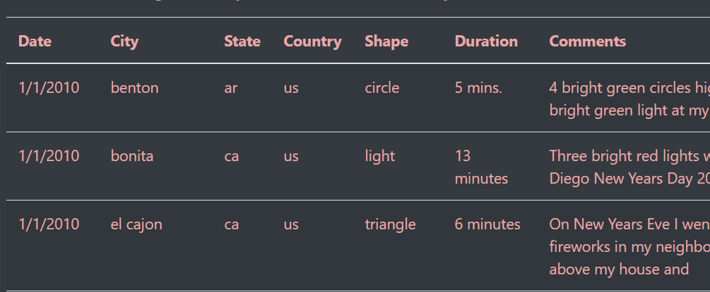
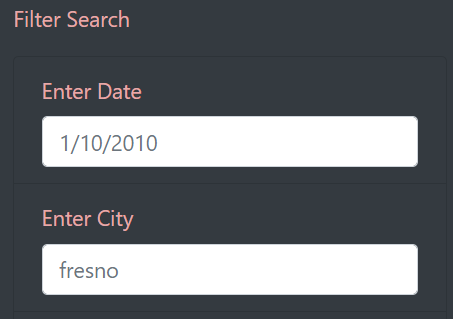
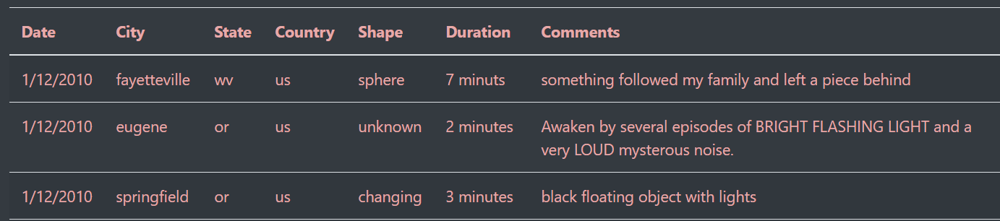
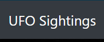

# UFOs
# Overview of the analysis:
  ### The purpose of analysis today was to build a website in which a user (UFO enthusiast) can search for sighting information. Dana has tasked us with using our newly learned JavaScript, html and bootstrap skills to build this interactive website. We built an app with two functions, one to allow us to see an aesthetically pleasing table to display our data and another to update the filters on the page every time a user enters input.
 
 
 
 
# Results:
  ### Description of how to perform a search on website.
   1. The website has 5 filters that a user may search by to filter the table on the page. 
   
   2. Use the place holder input to determine how to input your search criteria. Please be mindful the filters have strict parameters for input.
   3. You can use multiple filters, they can be built upon, but it has to be done one layer at a time.
      a. For example, if you enter '1/12/2010' in the date filter, you can then enter 'us' for the Country, then narrow it again by shape of the craft.
      
   5. Once you have the data you need; the filters can be reset/cleared by clicking 'UFO Sightings' at the top of the page.
      

# Summary:

  - The main drawback of the website is how the results are displayed from the searches. The results should be able to be filtered and also allow the user to see the options available to them because of how strict the filters are. The filters can only use lower case input and the date can only be entered in the specified format.

 * Additional recommendations for further development *
    1. First I would like to allow the user to view the specifics of the data that is available. For example, we have a Country filter that takes 2-character input. How would the user know what the abbreviations are for other countries? I would implement drop downs, so the user knows what options are available to them if they are unfamiliar with the dataset.
    2. Second, I would add the ability for the user to narrow the data and then export the data for their own analyses.
    3. Third, and this is minor, a count of results at the top of the table.

